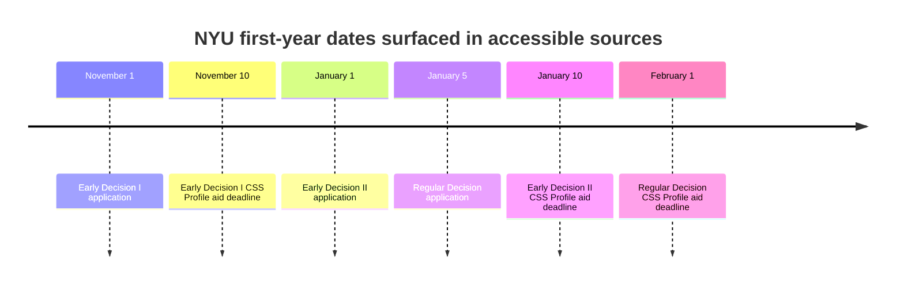

# NYU Forensic Aid Intelligence for a High-Need Bangladeshi Undergraduate Applicant

## Executive summary

This report focuses on **NYU New York first-year undergraduate admission and aid**, because NYU’s own aid pages split policy by campus and the current “NYU Promise” language on the accessible undergraduate aid pages is explicitly framed around the **New York campus** rather than NYU Abu Dhabi or NYU Shanghai. citeturn11view0turn11view1

The most important headline is that **NYU now publicly promises to meet 100% of demonstrated need for first-time, first-year undergraduates admitted to the New York campus**, and it states that **families with income below $100,000 and typical assets will not have to pay tuition**. In school-bulletin language describing the 2024-25 policy change, NYU says this Promise applies to **every undergraduate—domestic and international—who started as a first-year student admitted to the New York campus**. citeturn11view0turn11view1turn32search0turn32search3

The major complication is that the **latest publicly surfaced Common Data Set with Part H missing is 2024-25**, and NYU’s posted 2024-25 CDS explicitly says it was released **without Part H** and to “check back” for Part H. That means the latest publicly retrievable **H6 international-aid statistics** still appear to come from the **2022-23 CDS**, which predates the NYU Promise. In that legacy H6 snapshot, **505** undergraduate nonresidents received institutional aid, the **average award was $29,387**, and the **total institutional aid budget for those nonresidents was $14,810,988**. Against **7,532** total undergraduate nonresidents in CDS Section B, that implies a **coverage rate of about 6.7%**. citeturn1search3turn0search4turn40search1turn21search2

So the honest read is this: **NYU’s present official policy looks far stronger than its last fully public pre-Promise H6 data**. For a Bangladeshi student needing **$55,000–$75,000 per year**, NYU is now a **high-upside financial reach** rather than an obvious non-starter. But because the post-Promise international outcomes are **not yet publicly verifiable in a new H6 release**, NYU should still be treated as **speculative rather than dependable** for a student who must have very large aid. citeturn11view0turn32search3turn40search1turn1search3turn0search4

All cited web sources below were **retrieved on 21 May 2026**. Each citation resolves to the source URL.

## Institutional policy and admissions landscape

Under the current accessible NYU aid pages, **international and non-US citizens file the CSS Profile**, while FAFSA is reserved for **US citizens, permanent residents, and federally eligible non-citizens**. NYU says scholarship and grant funding for first-year undergraduates is determined from the CSS Profile. That matters because, for a Bangladeshi applicant, NYU’s institutional aid pathway is clearly open even without FAFSA eligibility. citeturn11view0turn11view1turn44view0

At the same time, I did **not** find an accessible official NYU page in this research session that explicitly labels undergraduate international admission as **need-blind** or **need-aware**. Because of that, the strict classification for “need-blind/need-aware status” should be **DATA NOT PUBLICLY AVAILABLE** rather than guessed. What NYU *does* clearly publish is the **post-admission aid promise** for first-year students at the New York campus. citeturn11view0turn11view1turn32search3

NYU’s scholarship language is also important for realism. In school-bulletin text, NYU says it offers **very few exclusively merit-based scholarships**, and that scholarship decisions often consider a mix of **academic achievement, test scores, and in some cases financial need**. It also says **no separate application is necessary** for exclusively merit-based scholarships. In plain English: NYU is **not** the kind of university where internationals should expect a large menu of automatic merit awards that reliably offset a high price tag. citeturn44view0

On selectivity, NYU’s own Class of 2029 news release says that **offers of admission to NYU’s New York campus were made to just 7.7% of more than 120,000 applicants**, and three undergraduate colleges—**CAS, Stern, and Rory Meyers Nursing**—admitted **fewer than 5%** of applicants. College Board’s BigFuture currently lists NYU overall with a **9.23% acceptance rate** and a typical SAT band of **1480–1550** for enrolled students. The NYU-campus figure is the more relevant “forensic” number for this report because the Promise discussed here is tied to NYU New York. citeturn20search15turn19search0turn34search3turn34search13

### Core policy classification

| Item | Finding | Source |
|---|---:|---|
| Campus analysed | **NYU New York** first-year undergraduate aid policy | NYU First-Year Applicants and Undergraduate Aid pages, retrieved 21 May 2026 citeturn11view0turn11view1 |
| Need-blind / need-aware status for internationals | **DATA NOT PUBLICLY AVAILABLE** | No accessible official public page in this session explicitly states the admissions-side label; current NYU pages reviewed focus on aid application and Promise terms rather than an admissions-side need-blind declaration. Relevant official pages retrieved 21 May 2026 citeturn11view0turn11view1turn17view0 |
| Meets full demonstrated need for international first-years at NYU New York | **Yes, according to current published policy** | NYU First-Year Applicants page and NYU bulletin language on the NYU Promise, retrieved 21 May 2026 citeturn11view0turn11view1turn32search3 |
| Tuition-free threshold | **Families under $100,000 income with typical assets do not have to pay tuition** | NYU First-Year Applicants page and NYU Promise announcement text, retrieved 21 May 2026 citeturn11view0turn11view1turn32search0 |
| International first-year aid form | **CSS Profile** | NYU aid application pages and Stern bulletin, retrieved 21 May 2026 citeturn11view0turn11view1turn44view0 |
| Merit aid availability | **Very few purely merit awards; mostly mixed need/merit; no separate merit application surfaced** | NYU bulletins, retrieved 21 May 2026 citeturn44view0 |
| Realistic admissions context | **Extremely selective reach** | NYU Class of 2029 release and College Board BigFuture, retrieved 21 May 2026 citeturn19search0turn20search15turn34search3turn34search13 |

## Application mechanics and deadlines

The current NYU undergraduate process is straightforward in structure but document-heavy in practice. NYU’s accessible admissions pages say applicants apply through the Common App, choose whether to submit testing, and then follow applicant-type instructions. NYU is **test-optional through the 2026-2027 application cycle**, and if an applicant does submit testing, NYU requires the applicant to choose **one** testing type for review. NYU accepts SAT, ACT, AP exams, IB, A-Levels, and a wide range of international exams. citeturn27view0turn27view1

For international applicants, NYU’s public international-qualifications content says that NYU reviews students in the context of their national or regional curriculum, accepts many international qualifications, and allows **official or unofficial** documents for review. Once admitted, however, final documents must become official, and students with non-US high-school credentials must send final proof of graduation for authentication through **ECE**. That matters for Bangladeshi applicants because final certificate logistics can become a real administrative step, not a minor detail. citeturn24view0turn25view0

NYU’s A-Level policy is especially relevant for Bangladeshi applicants from English-medium schools following the UK curriculum. NYU accepts **predicted or final A-Level results**, requires a **minimum of 3 A-Levels** for admissions eligibility, and says applicants to **Stern or Tandon should take A-Level Mathematics and/or Further Mathematics**. For English-language testing, NYU’s accessible FAQ language says students are exempt if English is their first language, or if they have been in a curriculum where English was the **only language of instruction for three consecutive years**; otherwise they may need English testing. Accessible official bulletin text lists TOEFL iBT, IELTS Academic, PTE Academic, Cambridge C1/C2, iTEP, and Duolingo among the possible tests used for NYU New York applicants. citeturn27view1turn31search0turn31search2turn30search0



The admissions deadlines above are the latest dates that surfaced in this session from an official NYU school page and College Board’s NYU profile, while the aid deadlines come from NYU’s current undergraduate aid pages. Because the main NYU admissions deadlines page was not fully readable in plain text during this session, treat the **application dates as high-confidence but still verify on the live NYU admissions page before submission**. The **aid dates** came directly from current NYU aid pages and are the stronger deadline evidence in this report. citeturn19search13turn34search13turn11view0turn11view1

### Key application facts

| Item | Current evidence | Source |
|---|---:|---|
| Test policy | **Test-optional through 2026-2027** | NYU Standardized Tests page, retrieved 21 May 2026 citeturn27view1 |
| International aid application | **CSS Profile** | NYU First-Year Applicants / Undergraduate Aid, retrieved 21 May 2026 citeturn11view0turn11view1 |
| CSS code | **2785** | NYU How to Apply for Financial Aid, retrieved 21 May 2026 citeturn11view1 |
| FAFSA code | **002785** | NYU How to Apply for Financial Aid, retrieved 21 May 2026 citeturn11view1 |
| International document rule | Official or unofficial docs may be used for review; final official proof required after admission | NYU International Qualifications Tool details, retrieved 21 May 2026 citeturn25view0 |
| Final non-US school documents | **ECE authentication required after admission** | NYU Standardized Tests and Qualifications detail pages, retrieved 21 May 2026 citeturn27view1turn25view0 |

## Cost structure and aid evidence

NYU’s published **2025-2026 undergraduate cost of attendance** for a full-time student is **$96,988** for an on/off-campus student, consisting of **$65,622 tuition**, **$25,516 food and housing**, **$1,470 books and supplies**, **$2,366 transportation**, and **$2,014 personal expenses**. For a commuter student, the published total is **$78,112**, but that is not the realistic baseline for a Bangladesh-based first-year applicant. citeturn12view0turn12view1turn12view2

The strongest historical aid evidence for internationals remains the **2022-23 CDS H6**, because NYU’s posted **2024-25 CDS was released without Part H**. In the 2022-23 H6 data, NYU reported that **505** undergraduate degree-seeking nonresidents received institutional aid, with an **average award of $29,387** and a **total institutional aid budget of $14,810,988** for those nonresidents. CDS Section B for the same 2022-23 CDS showed **7,532 total undergraduate nonresidents** and **5,892 degree-seeking undergraduate nonresidents**. citeturn1search3turn0search4turn40search1turn21search2

Using the methodology’s default denominator of **total international undergraduate enrolment from CDS Section B**, NYU’s 2022-23 international institutional-aid **coverage rate** works out to about **6.7%** (**ESTIMATE**, computed as 505 ÷ 7,532). Using the narrower **degree-seeking** denominator, the rate would be about **8.6%** (**ESTIMATE**, computed as 505 ÷ 5,892). Either way, the pre-Promise public H6 picture was **thin** rather than broad. The corresponding **institutional budget per international undergraduate** is about **$1,966** (**ESTIMATE**, computed as $14,810,988 ÷ 7,532), which is another way of seeing how limited the legacy distribution was across the overall international undergraduate population. citeturn40search1turn21search2

However, those H6 figures are **legacy data**. They predate the policy shift that NYU says began in **Fall 2024** under the NYU Promise. That is exactly why NYU is difficult to classify on old intuition alone: the school’s **current official promise is much stronger than its latest fully public international H6 record**. citeturn32search0turn32search3turn1search3turn0search4

### Verified aid metrics

| Metric | Value | Source |
|---|---:|---|
| 2025-26 total cost of attendance | **$96,988** | NYU Cost of Attendance page, retrieved 21 May 2026 citeturn12view0turn12view1 |
| 2025-26 tuition | **$65,622** | NYU Cost of Attendance page, retrieved 21 May 2026 citeturn12view0turn12view1 |
| 2025-26 food and housing | **$25,516** | NYU Cost of Attendance page, retrieved 21 May 2026 citeturn12view0turn12view2 |
| Latest surfaced CDS with Part H problem | **2024-25 posted without Part H** | NYU CDS posting, retrieved 21 May 2026 citeturn1search3turn0search4 |
| Latest public H6 year usable in this report | **2022-23** | NYU CDS 2022-23, retrieved 21 May 2026 citeturn40search1turn21search2 |
| H6 recipients | **505** | NYU CDS 2022-23, retrieved 21 May 2026 citeturn40search1 |
| H6 average institutional aid | **$29,387** | NYU CDS 2022-23, retrieved 21 May 2026 citeturn38search0turn40search1 |
| H6 total institutional aid to nonresidents | **$14,810,988** | NYU CDS 2022-23, retrieved 21 May 2026 citeturn38search0 |
| CDS B total undergraduate nonresidents | **7,532** | NYU CDS 2022-23, retrieved 21 May 2026 citeturn21search2 |
| CDS B degree-seeking undergraduate nonresidents | **5,892** | NYU CDS 2022-23, retrieved 21 May 2026 citeturn21search2 |
| H6 coverage using total undergrad nonresidents | **6.7%** **ESTIMATE** | Derived from official CDS values above, retrieved 21 May 2026 citeturn40search1turn21search2 |
| H6 coverage using degree-seeking nonresidents | **8.6%** **ESTIMATE** | Derived from official CDS values above, retrieved 21 May 2026 citeturn40search1turn21search2 |
| Institutional-aid budget per international undergraduate | **$1,966** **ESTIMATE** | Derived from official CDS values above, retrieved 21 May 2026 citeturn38search0turn21search2 |

### Typical package components for a Bangladeshi international

For a standard Bangladeshi first-year applicant, the **real NYU package components** should be understood as follows. Current NYU pages say institutional scholarship/grant review is based on the **CSS Profile**. Federal grants, federal loans, and Federal Work-Study are tied to **FAFSA eligibility**, which international F-1 students do not normally have. A current NYU financial-aid explainer says new freshmen who applied for aid on time receive **scholarship funding based on demonstrated financial need**, while loans are available for families who *prefer* to finance their contribution; it also explains that Federal Work-Study appears only when a student has filed a FAFSA and demonstrated need. NYU’s private loans page says private loans are separate, non-federal borrowing options and should be evaluated carefully. citeturn11view0turn17view0turn43view0turn16search4

That means the realistic international package is likely to be:

| Component | Likely for Bangladeshi first-year? | Why |
|---|---:|---|
| NYU institutional scholarship / grant | **Yes, if awarded** | CSS Profile drives institutional review. citeturn11view0turn17view0 |
| Federal Pell / federal grants | **No** | FAFSA-linked and not for ordinary international applicants. citeturn11view0turn17view0 |
| Federal loans | **No** | FAFSA-linked federal programmes. citeturn17view0turn43view0 |
| Federal Work-Study | **No, in normal international cases** | Current NYU explainer ties it to FAFSA filing and demonstrated need. citeturn43view0 |
| Private loans | **Possible but external to core aid package** | NYU says these are separate non-federal borrowing options. citeturn16search4turn43view0 |

Median institutional aid for international undergraduates is **DATA NOT PUBLICLY AVAILABLE** in the sources surfaced for this report. The same is true for a clean, current post-Promise average loan component specifically for international undergraduates.

For broader context only, College Board’s BigFuture currently lists NYU with **29.36% of students receiving financial aid**, an **average aid package of $68,216**, and a cost after scholarships and grants of **$30,730**. Those are useful context numbers, but they are **not** international-specific and they are **not** a substitute for H6. citeturn34search1

## Bangladesh-specific fit and estimated affordability

NYU’s international-qualifications framework is broadly friendly to applicants educated outside the United States. It explicitly says NYU reviews students in the context of their national or regional curriculum, and the country selector in the public tool includes **Bangladesh**. But in the accessible non-JavaScript output I could retrieve, the Bangladesh-specific country detail itself did **not** render. Because of that, any Bangladesh-specific SSC/HSC-only document rules beyond the general international rules are **DATA NOT PUBLICLY AVAILABLE** in this report. citeturn24view0turn25view0

For **Bangladesh English-medium / Cambridge A-Level** applicants, the fit is much clearer. NYU officially accepts predicted or final A-Level results, requires at least three A-Levels, and expects Mathematics/Further Mathematics for Stern or Tandon. For Bangladesh applicants from English-medium schools, NYU’s English-language-testing rules can also be favourable if the applicant has had at least **three consecutive years of English-only instruction**; otherwise an English test may be required. citeturn27view1turn31search0turn31search2

On Bangladesh- or South-Asia-specific scholarships, I found **no verified NYU-wide official scholarship page reserved specifically for Bangladeshi or South Asian undergraduate applicants** in the accessible official sources reviewed here. The correct forensic label is therefore **DATA NOT PUBLICLY AVAILABLE / no verified official school-specific programme surfaced in this review**, rather than an overconfident “none exist”. citeturn44view0turn17view0

### Affordability scenarios for a student needing $55k–$75k per year

The table below separates **legacy-statistical reality** from **current-policy upside**.

| Scenario | Aid assumption | Estimated family net cost | Interpretation |
|---|---:|---:|---|
| Legacy H6 average outcome | **$29,387** institutional aid (2022-23 H6 average) | **$67,601** **ESTIMATE** | Not workable for most students needing $55k–$75k in annual financing. citeturn12view1turn38search0turn40search1 |
| Current tuition-free threshold outcome | Tuition covered at **$65,622** | **$31,366** **ESTIMATE** | Potentially workable if NYU recognises income/assets in the Promise band and the family can cover living costs. citeturn11view0turn12view1 |
| Need recognised at **$55,000** | Policy-based financing need met at $55k | **$41,988** **ESTIMATE** | Borderline but possible for some families in this target band. citeturn11view0turn12view1 |
| Need recognised at **$75,000** | Policy-based financing need met at $75k | **$21,988** **ESTIMATE** | Strong fit if NYU’s CSS calculation aligns with the family’s real capacity. citeturn11view0turn12view1 |

These are **ESTIMATES** because NYU’s policy is based on **demonstrated need as calculated by NYU/CSS**, not on the family’s self-defined affordability number. A family that feels it needs $70,000 may discover that NYU computes its demonstrated need lower or higher than that. citeturn11view0turn11view1

### SAT-band utility for a high-need Bangladeshi applicant

The table below is an **ESTIMATE**, not a published NYU model. It combines NYU’s **7.7% New York-campus admit rate**, the College Board **1480–1550** SAT band currently shown for NYU-enrolled students, and the large current uncertainty about how the **post-2024 Promise** is converting into actual international award outcomes. citeturn19search0turn34search13turn11view0turn32search3

| SAT band | Position relative to surfaced NYU score context | Admission utility | Funding utility if admitted | Overall expected utility |
|---|---|---|---|---|
| **1350** | Well below the current 1480–1550 BigFuture band | **Very low** **ESTIMATE** | Potentially strong policy upside if admitted, but admission odds dominate | **Very low** **ESTIMATE** |
| **1430** | Still below current surfaced band | **Low** **ESTIMATE** | Better than 1350, but still hard to justify NYU as a core funding plan | **Low** **ESTIMATE** |
| **1480** | At the floor of the current surfaced band | **Low-to-moderate** **ESTIMATE** for otherwise exceptional applicants | If admitted, current Promise could make NYU genuinely affordable | **Medium** **ESTIMATE** |
| **1550** | At/above the current surfaced range | **Moderate** **ESTIMATE**, but still a brutal reach because NY-campus admits are 7.7% | Financial upside is strongest here if the rest of the profile is equally elite | **Medium-high** **ESTIMATE** |

The real lever at NYU is **not** simply scoring high. It is having a profile strong enough to win admission at a school where the New York campus is admitting fewer than one in twelve applicants, and then having CSS/Profile data that makes the NYU Promise meaningful in practice. citeturn19search0turn20search15turn11view0

## Honest verdict

For a **high-need Bangladeshi first-year applicant**, NYU is no longer easy to dismiss. Under current published policy, it has moved into the category of **“financially possible if admitted”**, especially for applicants whose family income/assets fit the Promise framework and whose need is genuinely in the **$55,000–$75,000** range. The current official language is materially stronger than what many counsellors historically associated with NYU. citeturn11view0turn11view1turn32search3

But the forensic caveat is just as important: the **latest public H6 evidence is still pre-Promise**, and it showed **low international-aid coverage and a modest average award** by the standards of a very expensive private university. Until NYU releases a post-Promise CDS with Part H, the university’s **current international aid execution is directionally promising but not yet fully auditable** from public data. citeturn40search1turn21search2turn1search3turn0search4

My honest verdict is therefore:

| Category | Verdict |
|---|---|
| Financial classification | **Policy-improved, but still not fully de-risked** |
| Admissions classification | **Extreme reach** |
| Bangladesh fit | **Good for A-Level / English-medium applicants; partial public visibility for Bangladesh-specific credential rules** |
| Best use on a college list | **Apply as an upside reach, not as a funding safety** |
| Bottom-line judgement | **NYU is worth an application for a truly top-end applicant, but it is not prudent to build a financing strategy that depends on NYU coming through.** |

This is the kind of school where a high-need Bangladeshi applicant should think: **“If I get in under the current Promise, this could work; but I cannot count NYU as one of my reliable full-funding anchors.”** citeturn11view0turn32search3turn40search1

## Data quality and confidence

Overall confidence is **medium**. Confidence is **high** on the current published NYU Promise language, the aid application route for international students, the 2025-26 cost of attendance, the test-optional policy, and the A-Level/international-document rules. Confidence is **medium-low** on current international aid *outcomes* because the latest posted CDS I could verify for NYU was released **without Part H**, forcing this report to rely on the older **2022-23 H6** for numerical international-aid reality. citeturn11view0turn11view1turn12view1turn27view1turn1search3turn0search4turn40search1

### QA checklist

| QA item | Status |
|---|---|
| Official NYU admissions, aid, cost, and CDS sources prioritised | **Completed** |
| College Board used as secondary contextual source | **Completed** |
| Most recent public H6 identified | **Completed** — **2022-23** used because **2024-25 posted without Part H**. citeturn1search3turn0search4 |
| Need-blind / need-aware status guessed? | **No** — marked **DATA NOT PUBLICLY AVAILABLE** |
| Missing data invented? | **No** |
| Estimates clearly labelled | **Yes** |
| Bangladesh-specific fit assessed separately from generic international fit | **Yes** |
| Honest verdict included | **Yes** |
| Open limitations stated | **Yes** |

### Open questions and limitations

The main unresolved issue is simple: **What does NYU’s post-2024 international H6 look like?** Until NYU publishes a newer CDS Part H, this remains the biggest public-data gap. A second limitation is that the Bangladesh-specific country detail inside NYU’s International Qualifications Tool did not fully render in accessible non-JavaScript output during this session. citeturn1search3turn0search4turn24view0turn25view0

## Structured JSON profile

```json
{
  "schema_version": "best_effort_reconstruction_from_user-described Bangladeshi Applicant Intelligence System requirements",
  "report_date": "2026-05-21",
  "language": "en-GB",
  "school": {
    "name": "New York University",
    "short_name": "NYU",
    "campus_scope": "NYU New York undergraduate first-year applicants",
    "country": "United States",
    "city": "New York, NY"
  },
  "methodology_status": {
    "used_bangladeshi_applicant_intelligence_system": true,
    "used_master_research_prompt_section_order_best_effort": true,
    "notes": "Exact attached schema could not be re-opened in this synthesis step, so this JSON is a best-effort structured profile built to cover all required fields named in the user brief."
  },
  "policy_classification": {
    "need_blind_or_need_aware_for_international": "DATA NOT PUBLICLY AVAILABLE",
    "meets_full_demonstrated_need_for_international_first_years": true,
    "policy_type_summary": "Current official NYU New York policy promises to meet 100% demonstrated need for admitted first-time, first-year undergraduates, including international students under the NYU Promise language surfaced in official bulletins.",
    "tuition_free_threshold": {
      "applies": true,
      "condition": "Families with income below $100,000 and typical assets do not have to pay tuition.",
      "campus_scope": "NYU New York"
    },
    "policy_change_last_three_years": {
      "changed": true,
      "effective_from": "2024-2025 academic year",
      "change_summary": "NYU Promise materially expanded affordability commitments beginning in Fall 2024."
    }
  },
  "admissions": {
    "overall_selectivity_context": {
      "nyu_new_york_class_of_2029_admit_rate": "7.7%",
      "nyu_new_york_applicants_class_of_2029": ">120000",
      "colleges_below_5_percent_in_class_of_2029": [
        "College of Arts and Science",
        "Leonard N. Stern School of Business",
        "Rory Meyers College of Nursing"
      ],
      "college_board_overall_acceptance_rate_context": "9.23%"
    },
    "testing_policy": {
      "test_optional_through_cycle": "2026-2027",
      "accepted_testing_options_if_submitted": [
        "SAT",
        "ACT",
        "AP exams",
        "IB",
        "A-Levels",
        "Other recognised international exams"
      ],
      "a_level_policy": {
        "minimum_a_levels": 3,
        "predicted_results_accepted": true,
        "stern_or_tandon_math_expectation": true
      }
    },
    "english_language_testing": {
      "may_be_required": true,
      "exemption_if_english_first_language": true,
      "exemption_if_three_years_english_only_instruction": true,
      "accepted_tests_surfaced": [
        "TOEFL iBT",
        "IELTS Academic",
        "PTE Academic",
        "Cambridge C1 Advanced / C2 Proficiency",
        "iTEP",
        "Duolingo"
      ]
    },
    "application_steps_summary": [
      "Apply via Common Application",
      "Choose whether to submit testing",
      "Submit academic transcripts",
      "Submit CSS Profile for scholarship review if seeking aid",
      "Submit English language testing if required",
      "After admission, provide official final documents and ECE-authenticated graduation proof if educated outside the United States"
    ],
    "deadlines_latest_surfaced_in_sources": {
      "ed1_application": "November 1",
      "ed2_application": "January 1",
      "regular_application": "January 5",
      "ed1_css_aid_deadline": "November 10",
      "ed2_css_aid_deadline": "January 10",
      "regular_css_aid_deadline": "February 1",
      "verification_note": "Application deadlines should be re-checked on NYU's live admissions page because the main deadline page was not fully readable in plain-text output during this session."
    }
  },
  "cost_of_attendance": {
    "academic_year": "2025-2026",
    "on_off_campus_total": 96988,
    "commuter_total": 78112,
    "tuition": 65622,
    "food_and_housing": 25516,
    "books_and_supplies": 1470,
    "transportation": 2366,
    "personal_expenses": 2014
  },
  "aid_application": {
    "international_first_year_required_form": [
      "CSS Profile"
    ],
    "domestic_additional_forms": [
      "FAFSA",
      "TAP if eligible"
    ],
    "css_profile_code": "2785",
    "fafsa_code": "002785"
  },
  "institutional_aid": {
    "merit_scholarships": {
      "separate_application_required": false,
      "purely_merit_awards_summary": "NYU offers very few exclusively merit-based scholarships.",
      "general_award_logic": "Combination of academic achievement, test scores, and in some cases financial need."
    },
    "renewability": {
      "most_undergraduate_institutional_awards_automatically_renewed": true,
      "caveat": "Continued eligibility and filing requirements may apply."
    }
  },
  "cds_h6": {
    "latest_public_h6_year_used": "2022-2023",
    "reason_not_newer": "NYU's 2024-2025 CDS was posted without Part H in the accessible source surfaced during research.",
    "recipients_nonresident_undergraduates": 505,
    "average_institutional_aid_award_usd": 29387,
    "total_institutional_aid_budget_usd": 14810988,
    "cds_b_total_undergraduate_nonresidents": 7532,
    "cds_b_degree_seeking_undergraduate_nonresidents": 5892,
    "coverage_rate_total_undergrad_nonresident_denominator": 0.067,
    "coverage_rate_degree_seeking_denominator": 0.086,
    "budget_per_total_international_undergraduate_estimate_usd": 1966,
    "computed_fields_are_estimates": true
  },
  "aid_reality_assessment": {
    "legacy_pre_promise_reality": "Weak to thin by coverage and average award standards for a very expensive university.",
    "current_policy_reality": "Much stronger official promise than legacy H6 suggests.",
    "current_public_verifiability": "Incomplete because post-Promise CDS Part H is not yet publicly surfaced in accessible form.",
    "package_components_for_typical_bangladeshi_student": {
      "institutional_scholarship_or_grant": "Possible",
      "federal_grants": "Not normally available",
      "federal_loans": "Not normally available",
      "federal_work_study": "Not normally available",
      "private_loans": "Possible but external to core aid package"
    },
    "median_institutional_aid_for_internationals": "DATA NOT PUBLICLY AVAILABLE",
    "average_loan_component_for_international_packages": "DATA NOT PUBLICLY AVAILABLE"
  },
  "bangladesh_specific_fit": {
    "country_in_nyu_qualifications_tool": true,
    "bangladesh_specific_public_rules_fully_rendered": false,
    "bangladesh_specific_public_rules_status": "DATA NOT PUBLICLY AVAILABLE",
    "a_level_fit": "Strong",
    "english_medium_fit": "Good, especially if three years of English-only instruction can be shown",
    "special_bangladeshi_or_south_asian_scholarships_at_nyu": "DATA NOT PUBLICLY AVAILABLE / no verified official NYU-wide scholarship surfaced in this review"
  },
  "affordability_scenarios": {
    "student_need_band_usd": [55000, 75000],
    "legacy_h6_average_net_cost_estimate_usd": 67601,
    "tuition_only_covered_net_cost_estimate_usd": 31366,
    "net_cost_if_need_recognised_at_55000_estimate_usd": 41988,
    "net_cost_if_need_recognised_at_75000_estimate_usd": 21988,
    "warning": "These are estimates against published 2025-2026 cost of attendance and assume NYU recognises the stated demonstrated need. CSS-calculated need may differ from family self-assessment."
  },
  "expected_utility_by_sat": {
    "1350": {
      "admission_utility_estimate": "Very low",
      "overall_utility_estimate": "Very low"
    },
    "1430": {
      "admission_utility_estimate": "Low",
      "overall_utility_estimate": "Low"
    },
    "1480": {
      "admission_utility_estimate": "Low-to-moderate for otherwise exceptional applicants",
      "overall_utility_estimate": "Medium"
    },
    "1550": {
      "admission_utility_estimate": "Moderate but still a reach",
      "overall_utility_estimate": "Medium-high"
    },
    "basis": "Estimated from NYU New York 7.7% admit rate and College Board 1480-1550 SAT context."
  },
  "verdict": {
    "summary": "Apply as a high-upside reach, not as a funding safety.",
    "honest_verdict": "NYU is now financially plausible if admitted under the current Promise, but post-2024 international aid execution is not yet fully auditable from public H6 data.",
    "best_for": "Elite applicants who can tolerate significant admissions risk and some uncertainty in realised international aid outcomes.",
    "not_best_for": "Applicants who need a predictably proven international full-funding track record."
  },
  "data_quality": {
    "overall_confidence": "Medium",
    "high_confidence_areas": [
      "Current NYU Promise language",
      "International CSS Profile pathway",
      "2025-2026 cost of attendance",
      "Test-optional policy",
      "A-Level and international document rules"
    ],
    "lower_confidence_areas": [
      "Current international aid outcomes after NYU Promise",
      "Exact Bangladesh-specific country-detail requirements",
      "Explicit need-blind/need-aware label for international undergraduates"
    ],
    "qa_checklist": {
      "official_sources_prioritised": true,
      "cds_h6_computed": true,
      "missing_data_marked": true,
      "estimates_labelled": true,
      "honest_verdict_included": true
    }
  },
  "sources": [
    {
      "title": "NYU First-Year Applicants",
      "url": "https://www.nyu.edu/admissions/financial-aid-and-scholarships/applying-as-a-prospective-undergraduate-student/first-year-applicants.html",
      "retrieved_on": "2026-05-21"
    },
    {
      "title": "NYU How to Apply for Financial Aid",
      "url": "https://www.nyu.edu/admissions/financial-aid-and-scholarships/applying-as-a-prospective-undergraduate-student.html",
      "retrieved_on": "2026-05-21"
    },
    {
      "title": "NYU Cost of Attendance",
      "url": "https://bulletins.nyu.edu/nyu/cost-attendance/",
      "retrieved_on": "2026-05-21"
    },
    {
      "title": "NYU Financial Aid Bulletin",
      "url": "https://bulletins.nyu.edu/nyu/cost-attendance/financial-aid/",
      "retrieved_on": "2026-05-21"
    },
    {
      "title": "NYU Stern Financial Aid Bulletin",
      "url": "https://bulletins.nyu.edu/undergraduate/business/cost-attendance/financial-aid/",
      "retrieved_on": "2026-05-21"
    },
    {
      "title": "NYU Standardized Tests",
      "url": "https://www.nyu.edu/admissions/undergraduate-admissions/how-to-apply/standardized-tests.html",
      "retrieved_on": "2026-05-21"
    },
    {
      "title": "NYU International Qualifications Tool",
      "url": "https://connect.nyu.edu/portal/credentials_iqtool",
      "retrieved_on": "2026-05-21"
    },
    {
      "title": "NYU International Qualifications Tool Details",
      "url": "https://connect.nyu.edu/register/iqtool_details",
      "retrieved_on": "2026-05-21"
    },
    {
      "title": "NYU Class of 2029 Admission Release",
      "url": "https://www.nyu.edu/about/news-publications/news/2025/march/nyu-sends-out-offers-of-admission-to-the-class-of-2029.html",
      "retrieved_on": "2026-05-21"
    },
    {
      "title": "NYU Common Data Set 2022-2023",
      "url": "https://www.nyu.edu/content/dam/nyu/institutionalResearch/documents/cds-on-website/CDS_2022-2023_FINAL.pdf",
      "retrieved_on": "2026-05-21"
    },
    {
      "title": "NYU Common Data Set 2024-2025 without Part H",
      "url": "https://www.nyu.edu/content/dam/nyu/institutionalResearch/documents/cds-on-website/CDS_2024-2025_Final%20for%20Release_wo%20PART%20H%20%28check%20back%20for%20for%20PART%20H%29.pdf",
      "retrieved_on": "2026-05-21"
    },
    {
      "title": "College Board BigFuture NYU Profile",
      "url": "https://bigfuture.collegeboard.org/colleges/new-york-university",
      "retrieved_on": "2026-05-21"
    },
    {
      "title": "College Board BigFuture NYU Admissions",
      "url": "https://bigfuture.collegeboard.org/colleges/new-york-university/admissions",
      "retrieved_on": "2026-05-21"
    },
    {
      "title": "College Board BigFuture NYU Tuition and Costs",
      "url": "https://bigfuture.collegeboard.org/colleges/new-york-university/tuition-and-costs",
      "retrieved_on": "2026-05-21"
    },
    {
      "title": "NYU Private Loans",
      "url": "https://www.nyu.edu/admissions/financial-aid-and-scholarships/types-of-aid/private-loans.html",
      "retrieved_on": "2026-05-21"
    },
    {
      "title": "What to Know About Your Financial Aid Package",
      "url": "https://meet.nyu.edu/advice/financial-your-education/what-to-know-about-your-financial-aid-package/",
      "retrieved_on": "2026-05-21"
    }
  ]
}
```